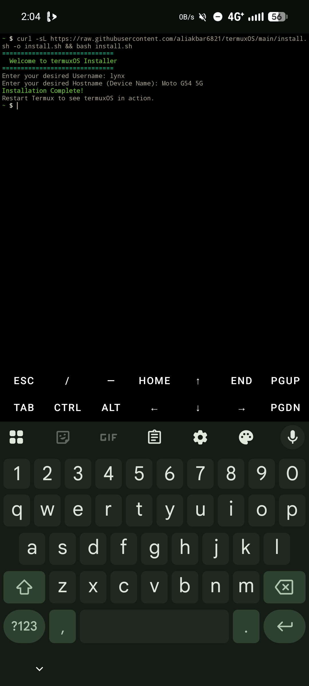
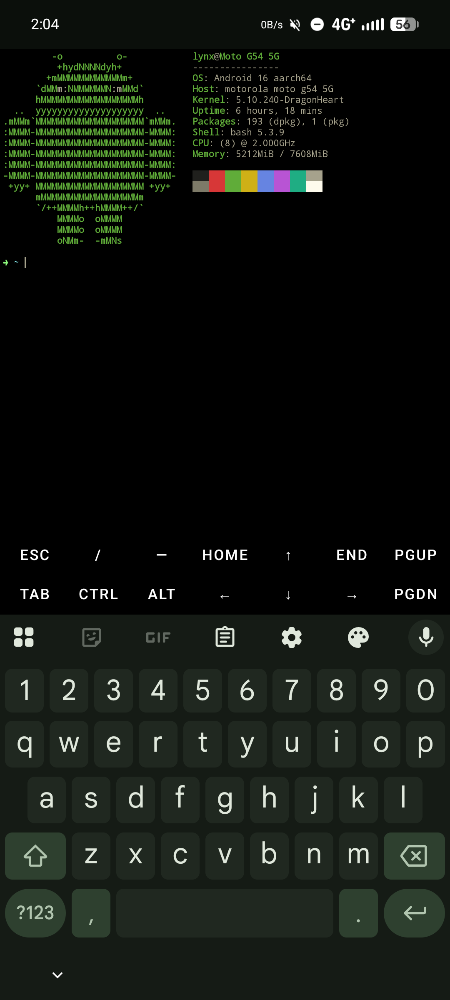

<div align="center">

# 🌌 termuxOS

*A lightweight, highly customizable, and pixel-perfect terminal environment for Termux on Android.*

[](#)
[](#)
[](#)
[](#)

</div>

---

## 📸 Previews

<p align="center">
  
  &nbsp;&nbsp;&nbsp;
  
</p>

---

## ✨ Features

| Feature | Description |
|---|---|
| 🎨 **MT Manager Aesthetic** | Default theme uses true-color ANSI (bright green arrow + pastel cyan path) to perfectly match the iconic MT Manager terminal style. |
| 🖥️ **Dynamic Neofetch Branding** | Visually spoofs hostname and username on startup without touching your actual Android system config. |
| 🔐 **Seamless Root Theming** | Custom `su` wrapper auto-injects your theme into KernelSU/Magisk root sessions — no aliases, no manual setup. |
| ⬛ **Pure Black AMOLED Mode** | Forces Termux background to true `#000000` for maximum contrast and battery savings on OLED screens. |
| 🔴 **Smart Error Indicator** | Prompt arrow turns red automatically if your last command exits with a non-zero code. |
| ⚙️ **Interactive Config Menu** | Built-in terminal menu (`init`) to switch themes and settings live — no file editing required. |

---

## 📋 Requirements

Before installing, make sure the following are in place:

- **Termux** (F-Droid version recommended — Play Store version is outdated)
- **Bash 5.x** — included in Termux by default (`pkg install bash`)
- **curl** — for the one-line installer (`pkg install curl`)
- **Root access** via **KernelSU** or **Magisk** *(optional — only needed for the root session theming feature)*
- **A Termux-compatible terminal emulator** with 24-bit true color support (Termux's built-in terminal works perfectly)

---

## 🚀 Installation

Copy and paste this single command into your Termux terminal:

```bash
curl -sL https://raw.githubusercontent.com/aliakbar6821/termuxOS/main/install.sh -o install.sh && bash install.sh
```

> **⚠️ Important:** After installation completes, fully close Termux (type `exit` or swipe it away from recents) and reopen it. The theme only activates on a fresh session.

---

## 🎨 Customization

termuxOS ships with a built-in configuration tool. At any point, just type:

```bash
init
```

From the menu, you can:

1. **Toggle Neofetch** — Turn the startup banner and system info on or off.
2. **Rename System** — Change the username and hostname displayed in Neofetch.
3. **Switch Theme** — Pick from built-in presets:
   - `Default MT` — Bright green arrow, pastel cyan directories (MT Manager style)
   - `Hacker` — Classic terminal green-on-black
   - `Cyberpunk` — Hot pink and electric yellow
4. **Custom Colors** — Input your own ANSI escape codes directly.

> **💡 Pro Tip:** termuxOS supports full **24-bit true color**. You can use standard codes like `1;31m` (bold red) or exact RGB codes like `38;2;140;247;123m` to match any specific hex color.

---

## 🛡️ Root Session Theming

Standard terminal themes break the moment you type `su` because Android drops you into a bare `/system/bin/sh` with no environment.

**termuxOS solves this.** During installation, a custom binary wrapper is placed in Termux's `/usr/bin/`:

- When you type `su`, Termux intercepts it and instructs KernelSU/Magisk to launch Termux's own Bash shell while preserving your environment variables (`su -p -s /data/data/com.termux/files/usr/bin/bash`).
- Result: type `su`, get a fully themed root shell instantly.

No clunky aliases. No `.bashrc` hacks. It just works.

---

## 🗑️ Uninstallation

termuxOS can cleanly remove itself without affecting your personal files:

1. Type `init` to open the config menu.
2. Select **Option 4** → `Uninstall termuxOS & Restore Default Termux`.
3. Confirm with `y`.
4. Fully restart Termux.

### 🛠️ Post-Uninstall Fix: `su` Not Found

If after uninstalling, `su` says "command not found," the original Termux `su` wrapper needs to be restored. Run:

```bash
pkg install --reinstall termux-tools
```

---

## 🤝 Contributing

Pull requests are welcome. For major changes, open an issue first to discuss what you'd like to change.

---

<div align="center">

**Developed with 💻 by Lуиχ**

*For the Android Dev & ROM Porting Community*

</div>
